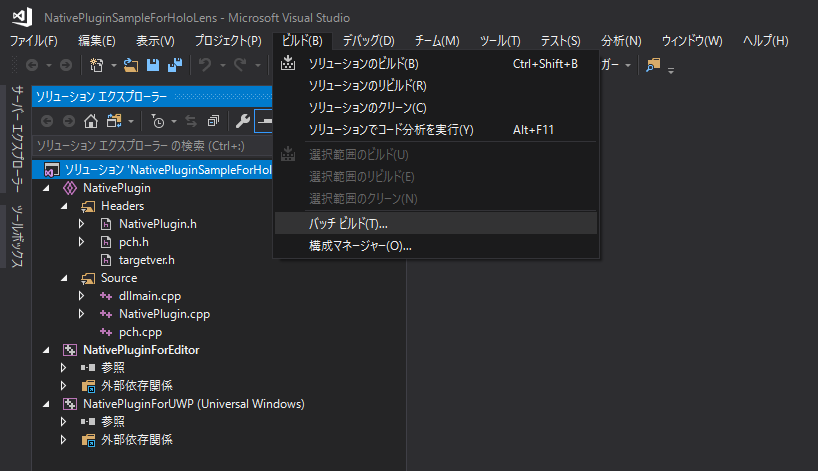
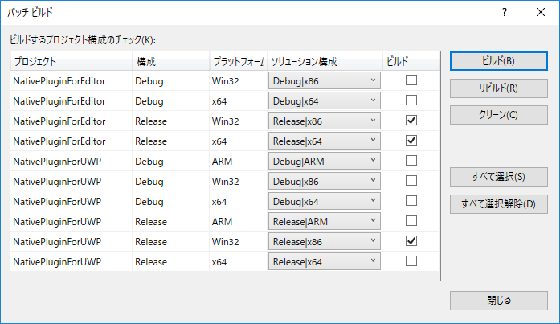
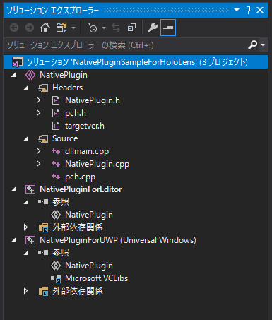
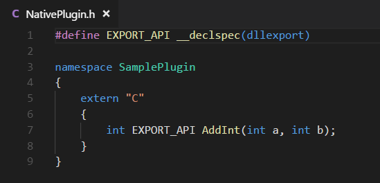
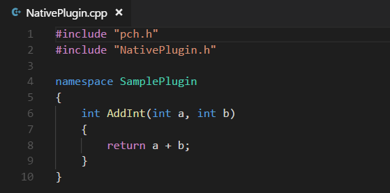

# Native Plugin Sample for HoloLens

## 概要
HoloLens用のNative Pluginを作成するためのサンプルプロジェクト。  
ソリューション構成は、UnityEditor用DLLのプロジェクトとHoloLens(UWP)用DLLのプロジェクトをまとめた形になっている。  
プロジェクト設定が煩雑だったので、今後はこのプロジェクトをテンプレートとして流用していきたい。

このプロジェクトで作成されたDLLを使っているUnityのサンプルプロジェクトは[こちら](https://github.com/sotanmochi/UnityProjectForNativePluginSample)を参照。

## 開発環境
- Visual Studio 2017

## ビルド方法
1. Visual Studio 2017で「NativePluginSampleForHoloLens.sln」を開く

2. ビルド -> バッチビルド を選択

3. ビルドするプロジェクトを選択してビルドを実行する。HoloLens(UWP)用DLLとUnityEditor用DLL(32bit/64bit)を選択する。

4. ビルドが成功すると3つのDLLが生成される
- UnityEditor(32bit)用DLL -> NativePluginSampleForHoloLens\Release\NativePluginForEditor\NativePlugin.dll
- UnityEditor(64bit)用DLL -> NativePluginSampleForHoloLens\x64\Release\NativePluginForEditor\NativePlugin.dll
- HoloLens(UWP)用DLL -> NativePluginSampleForHoloLens\Release\NativePluginForUWP\NativePlugin.dll

## 解説
ソリューション構成は以下の通り。
- NativePlugin -> ソースコード管理用の共有プロジェクト
- NativePluginForEditor -> UnityEditorでの実行時に利用されるDLL用のプロジェクト
- NativePluginForUWP -> HoloLens実機での実行時に利用されるDLL用のプロジェクト

ソースコードは共有プロジェクトの「NativePlugin」に含まれている。  
メインとなるコードは「NativePlugin.h」と「NativePlugin.cpp」である。  
今回のサンプルでは2つの整数の和を計算する単純な関数を実装した。

